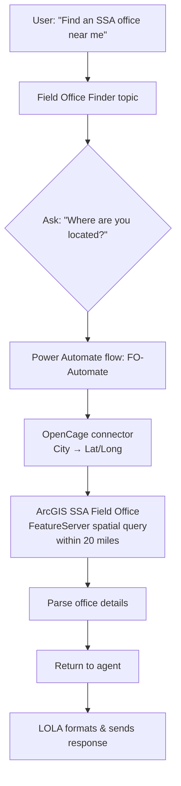

# LOLA — Local Office Lookup Agent

LOLA is a **Microsoft Copilot Studio** agent that helps people find the **Social Security Administration (SSA) field office closest to a given location**. The user provides a city or address, and LOLA returns the nearest field office (within 20 miles) along with its address, phone, fax, and hours of operation.

> **What it does in one line:** *"Where are you located?" → nearest SSA field office within 20 miles.*

> [!NOTE]
> **This is a demonstration / proof-of-concept agent.** It is intended to be deployed and explored in a **sandbox or developer environment**, not in production. Use it to learn the pattern — collecting input, calling a custom connector, orchestrating a Power Automate flow, and formatting a response — and adapt it to your own scenarios.

---

## Table of Contents

- [Features](#features)
- [How It Works](#how-it-works)
- [Architecture](#architecture)
- [Sample Run-Through](#sample-run-through)
- [Project Structure](#project-structure)
- [Components in Detail](#components-in-detail)
- [Setup & Deployment](#setup--deployment)
- [Data Sources](#data-sources)
- [Limitations](#limitations)

---

## Features

- 🔎 **Natural-language lookup** — ask for a Social Security office near a place and LOLA prompts for the location.
- 📍 **Geospatial search** — geocodes the location and finds the nearest SSA field office within a 20-mile radius.
- 🏢 **Rich office details** — returns office name, street address, city, state, ZIP, phone, fax, and hours.
- ☎️ **Always-on fallback** — every response includes the SSA National 800 Number for additional help.
- 💬 **Multi-channel** — available on **Telephony**, **Microsoft Teams**, and **Microsoft 365 Copilot**.
- 🧠 **Generative answers** — non-lookup questions are answered from configured knowledge sources.

---

## How It Works

1. The user asks to find a Social Security field office.
2. The **Field Office Finder** topic triggers and asks **"Where are you located?"**
3. LOLA passes that location to a **Power Automate cloud flow**.
4. The flow **geocodes** the location (city → latitude/longitude) via the **OpenCage** custom connector.
5. The flow performs a **spatial query** against the public **SSA Field Office** ArcGIS feature service, requesting the single nearest office within **20 statute miles**.
6. The office's details are parsed and returned to the agent.
7. LOLA formats the result into a friendly, consistent response.



---

## Architecture

| Layer | Component | Responsibility |
|-------|-----------|----------------|
| **Conversation** | Copilot Studio agent (`agent.mcs.yml`) | Instructions, conversation starters, response formatting |
| **Topic** | `topics/FieldOfficeFinder.mcs.yml` | Collects location, invokes the flow, renders the result |
| **Topic** | `topics/Search.mcs.yml` | Generative answers from knowledge sources for off-topic questions |
| **Action** | `actions/Opencage-...mcs.yml` | Wraps the OpenCage geocoding call |
| **Connector** | `connectors/new_opencage-.../` | Custom connector to the OpenCage Forward Geocoding API |
| **Automation** | `workflows/FO-Automate-.../workflow.json` | Geocodes the location and queries the SSA office dataset |

---

## Sample Run-Through

Below is an example conversation showing the end-to-end experience.

**User**
> I need to find a Social Security Field Office near me

**LOLA**
> Where are you located?

**User**
> McKinney, TX

*(LOLA geocodes "McKinney, TX", queries the SSA office dataset for the nearest office within 20 miles, and responds.)*

**LOLA**
> **SSA Field Office Closest to McKinney, TX**
>
> After calculating distance from McKinney, TX and searching the SSA field office database, below is a SSA field office within 20 Miles:
>
> **MCKINNEY TX SSA Field Office**
>
> **Address:** 3250 CRAIG DR
>
> **City:** MCKINNEY
>
> **State:** TX
>
> **ZIP Code:** 75070
>
> **Phone:** (866) 931-2731
>
> **Fax:** (833) 939-1986
>
> **Hours of Operation:** Monday - Friday: 9:00 AM - 4:00 PM Local Time
>
> Please contact us at the Social Security Administration National 800 Number (N800N): **+1-800-772-1213** between **8am-7pm local time** Monday-Friday.

---

## Project Structure

```
LOLA (Local Office Lookup Agent)/
├── agent.mcs.yml                 # Agent definition: instructions, starters, knowledge
├── settings.mcs.yml              # Channels, auth, AI settings
├── connectionreferences.mcs.yml  # Connection references (OpenCage)
├── actions/
│   └── Opencage-Getlatitudeandlongitudefromacityname.mcs.yml
├── connectors/
│   └── new_opencage-.../         # Custom OpenCage connector (OpenAPI + metadata)
├── topics/
│   ├── FieldOfficeFinder.mcs.yml # Core lookup topic
│   ├── Search.mcs.yml            # Generative answers
│   └── ...                       # Standard system topics (Greeting, Fallback, etc.)
└── workflows/
    └── FO-Automate-.../workflow.json  # Power Automate geocode + SSA lookup flow
```

---

## Components in Detail

### Agent (`agent.mcs.yml`)
Defines the agent's display name, description, and a conversation starter ("I need to find a Social Security Field Office near me"). It also sets the standardized response template used to present office details and the SSA National 800 Number.

### Field Office Finder topic (`topics/FieldOfficeFinder.mcs.yml`)
The heart of the agent. It:
1. Asks **"Where are you located?"** and stores the answer in `Topic.Location`.
2. Calls the Power Automate flow (`InvokeFlowAction`), passing the location text.
3. Binds the returned office fields (name, address1/2, city, state, ZIP, phone, fax) to topic variables.
4. Renders the formatted response.

### OpenCage connector & action
A custom connector wrapping the **OpenCage Forward Geocoding API** (`api.opencagedata.com/geocode/v1/json`). The `ForwardGeocoding` operation converts a city/place string into latitude/longitude coordinates.

### Power Automate flow (`workflows/FO-Automate-.../workflow.json`)
1. **Trigger:** receives a `text` (Location) input from the agent.
2. **Geocode:** calls the OpenCage connector to get lat/long.
3. **Spatial query:** issues an HTTP GET to the public **SSA Field Office Information** ArcGIS FeatureServer with an `esriGeometryPoint`, a 20-mile (`esriSRUnit_StatuteMile`) radius, and `resultRecordCount=1` to get the single nearest office.
4. **Parse & extract:** parses the JSON response and sets variables for office name, address, city, state, ZIP, phone, and fax.
5. **Respond:** returns the office details back to the agent.

---

## Setup & Deployment

Full step-by-step deployment instructions — prerequisites, importing the agent, creating the OpenCage connection, verifying the flow, configuring channels, publishing, and troubleshooting — are in **[POC-SETUP.md](POC-SETUP.md)**.

This agent is a **demonstration / proof-of-concept** intended for **sandbox or developer** environments. You'll bring your own free [OpenCage](https://opencagedata.com/) API key, which is entered into the connection at deployment time (it is not stored in this repository).

---

## Data Sources

- **Geocoding:** [OpenCage Forward Geocoding API](https://opencagedata.com/) — converts place names to coordinates.
- **SSA offices:** Public **SSA Field Office Information** ArcGIS FeatureServer (hosted on ArcGIS Online). Provides office name, address, contact info, and hours.

---

## Limitations

- Returns only the **single nearest** office within 20 miles; locations with no office in range will not return a result.
- Office **hours** are presented as a standard Mon–Fri 9:00 AM–4:00 PM schedule in the response template; verify against the live dataset if exact per-day hours matter.
- Accuracy depends on the OpenCage geocoding result for the user's input and the freshness of the SSA ArcGIS dataset.
- This is an **unofficial** lookup helper and is not affiliated with or endorsed by the U.S. Social Security Administration.

---

*For official information, always refer to [ssa.gov](https://www.ssa.gov/) or call the SSA National 800 Number at **+1-800-772-1213**.*

