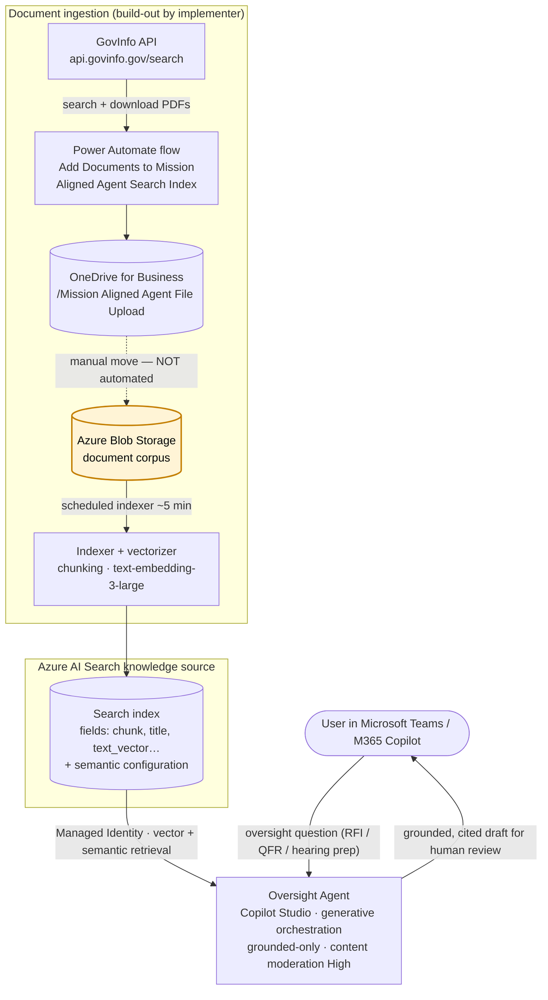

# Congressional Oversight Response Agent (Oversight Agent)

> **Sample Solution** — This repository contains a reference, proof-of-concept implementation of the **Oversight Agent** (Congressional Oversight Response Agent), intended for evaluation and testing in a sandbox / developer environment. It is **not** production-ready and does **not** provide legal advice. Every response it produces is a **draft for human review** by designated owners (Legislative Affairs / General Counsel / Policy).

The Oversight Agent helps agency staff draft accurate, professional, citation-backed responses to Congressional oversight inquiries — Requests for Information (RFIs), Questions for the Record (QFRs), and hearing-preparation questions — using **only** approved agency knowledge sources (prior testimony, hearing transcripts, QFR/RFI responses, GAO reports, and approved policy memos).

The agent is deliberately constrained to prioritize **accuracy, traceability, and neutrality** over completeness. It does not fabricate, speculate, or use outside/web knowledge; when the record does not support an answer, it says so and identifies the source that would be required.

---

## Table of Contents

- [Intended Use](#intended-use)
- [Key Capabilities](#key-capabilities)
- [What's in the Package](#whats-in-the-package)
- [Architecture](#architecture)
- [Getting Started](#getting-started)
- [Build the Azure AI Search Knowledge Source (Required)](#build-the-azure-ai-search-knowledge-source-required)
- [Document Ingestion Flow](#document-ingestion-flow)
- [Response Structure](#response-structure)
- [Security & Compliance Notes](#security--compliance-notes)
- [Known Gaps & Limitations](#known-gaps--limitations)
- [Disclaimer](#disclaimer)

---

## Intended Use

The agent is intended **solely** as a drafting and information-retrieval aid for authorized agency staff preparing responses to Congressional oversight. All output is a **draft** and must be independently reviewed and cleared by the designated response owners before use. The agent does not provide legal advice and will refuse requests for classified, controlled unclassified (CUI), or otherwise restricted information, recommending appropriate channels instead.

---

## Key Capabilities

- Drafts citation-backed responses to oversight inquiries, RFIs, QFRs, and hearing-prep questions.
- Grounds **every** factual claim in an approved source (citation-first); omits any claim it cannot cite.
- Produces a structured deliverable: Executive Summary, Draft Response, **Gaps / Not Found in Record**, and a **Source List**.
- Supports a **QFR style** format when multiple numbered questions are supplied.
- Maintains a neutral, oversight-ready tone and refuses fabrication, speculation, policy interpretation beyond the record, and advocacy.
- Keeps a strict **human-in-the-loop** posture — all output is a draft for designated reviewers.

---

## What's in the Package

The solution file [assets/OversightAgent_1_0_0_1_portable.zip](assets/OversightAgent_1_0_0_1_portable.zip) is an **unmanaged** Microsoft Copilot Studio solution (version `1.0.0.1`) that contains:

- The **Oversight Agent** Copilot Studio agent, configured for the **Microsoft Teams** and **Microsoft 365 Copilot** channels, with generative orchestration enabled and content moderation set to **High**. The agent is grounded (`useModelKnowledge: false`) — it answers only from its configured knowledge source.
- An **Azure AI Search** knowledge source configuration (index and semantic configuration referenced by name) bound to an **Azure AI Search connection reference**.
- One supporting **Power Automate** cloud flow:
  - **Add Documents to Mission Aligned Agent Search Index** — a button-triggered flow that queries the public [GovInfo](https://api.govinfo.gov) API for documents matching a search term, downloads the matching PDFs, and saves them to a **OneDrive for Business** folder (`/Mission Aligned Agent File Upload`) for indexing.
- **Connection references** used by the solution:
  - **Azure AI Search** (`shared_azureaisearch`)
  - **OneDrive for Business** (`shared_onedriveforbusiness`)

Because the bundled flow and knowledge source interact with Azure AI Search, OneDrive, and an external API, evaluators will be prompted to supply or create the corresponding connections during import, and must stand up the Azure AI Search index separately (see below).

---

## Architecture



<details>
<summary>Text (ASCII) version of the same flow</summary>

```
   GovInfo API ──▶ [Power Automate flow] ──▶ OneDrive for Business
                                                (/Mission Aligned Agent File Upload)
                                     |
                                     ▼   manual move  ◀── NOT AUTOMATED (see note)
                          Azure Blob Storage container
                                     |
                                     ▼   Azure AI Search indexer (scheduled, ~5 min)
                   [ Azure AI Search index + vectorization ]
                   (chunking, text-embedding-3-large, semantic config, Managed Identity)
                                     |
                                     ▼
   User (Teams / M365 Copilot) ──▶ Oversight Agent (Copilot Studio) ──▶ grounded, cited draft
```

</details>

- **User channels:** Microsoft Teams and Microsoft 365 Copilot.
- **Reasoning:** Copilot Studio generative orchestration; content moderation **High**; grounded-only (no model world-knowledge).
- **Knowledge:** Azure AI Search index (vector + semantic), referenced by index name and semantic configuration name; the agent's Azure AI Search connection authenticates with **Managed Identity**.
- **Ingestion:** The Power Automate flow lands approved source PDFs in OneDrive for Business. Those files are then **moved manually to an Azure Blob Storage container**, where a **scheduled Azure AI Search indexer** (~5-minute interval) chunks and vectorizes them into the index. The OneDrive → Blob move is the one step that is not automated.

---

## Getting Started

This solution is delivered as a **Microsoft Copilot Studio** agent, packaged as a solution `.zip` located at [assets/OversightAgent_1_0_0_1_portable.zip](assets/OversightAgent_1_0_0_1_portable.zip).

### Prerequisites

- A Microsoft **Power Platform** environment where you can import solutions (System Administrator or System Customizer role recommended).
- Access to **Microsoft Copilot Studio** in that environment.
- An **Azure AI Search** service you can configure, plus permission to create an index, indexer, and vectorizer.
- An **Azure Blob Storage** container to hold the document corpus the indexer reads, and an embedding model deployment (**`text-embedding-3-large`**) the search service can call.
- Licensed connectors / permissions for the connection references used by the solution: **Azure AI Search** and **OneDrive for Business**.
- A **GovInfo API key** (free) from https://api.govinfo.gov/docs/ if you intend to run the ingestion flow.

### Installation

1. Clone or download this repository and locate `assets/OversightAgent_1_0_0_1_portable.zip`.
2. **Build the Azure AI Search index first** (see the next section) so its name matches the agent's knowledge-source configuration.
3. Sign in to the [Power Platform admin center](https://admin.powerplatform.microsoft.com/) and confirm the target environment.
4. Open **Copilot Studio** (or **Power Apps** → **Solutions**) and select the target environment.
5. Choose **Solutions** → **Import solution**, browse to `assets/OversightAgent_1_0_0_1_portable.zip`, and select **Next**.
6. When prompted, create or select the **connection references**:
   - **Azure AI Search** — point at your Azure AI Search service (endpoint + admin/query key or managed identity).
   - **OneDrive for Business** — the account whose drive holds `/Mission Aligned Agent File Upload`.
7. Complete the import. The solution is configured to publish the agent on import; confirm the published agent in Copilot Studio reflects your environment's connection references.
8. In Copilot Studio, open the **Oversight Agent** and verify the Azure AI Search **knowledge source** resolves to your index and semantic configuration (update the index name if yours differs).
9. Provide your **GovInfo API key** to the ingestion flow (replace the `<YOUR_GOVINFO_API_KEY>` placeholder in the `Initialize variable - apiKey` step, or refactor it to an environment variable).
10. Run the ingestion flow to populate OneDrive, then **move the documents into your Azure Blob Storage container** so the scheduled indexer picks them up (see [Document Ingestion Flow](#document-ingestion-flow)).
11. Test the agent with non-production users in **Teams** and **Microsoft 365 Copilot**.

> **Note:** This is a sample for evaluation. Validate connection references, data sources, security roles, and data-handling requirements in a non-production environment before testing with real users.

---

## Build the Azure AI Search Knowledge Source (Required)

**The exported solution references an Azure AI Search index but does NOT create it.** The POC implementer must stand this up. In the original POC the index was produced with the Azure AI Search **"Import and vectorize data"** wizard (which yields the field names and `rag-<timestamp>` naming seen below), embeddings used **`text-embedding-3-large`**, and the service authenticated with **Managed Identity**. The agent expects an index shaped like this:

| Setting | Value expected by the agent |
| --- | --- |
| Index name | `rag-1773947827982` — auto-generated by the wizard; **rename freely** and update the agent's knowledge source to match |
| Selected fields | `chunk_id`, `parent_id`, `chunk`, `title`, `text_vector` |
| Semantic configuration | `rag-1773947827982-semantic-configuration` |
| Vector field | `text_vector`, populated by **`text-embedding-3-large`** |
| Data source | **Azure Blob Storage** container (the corpus store the indexer reads) |
| Indexer | **Scheduled** (~5-minute interval in the POC) |
| Auth | **Managed Identity** (Azure AI Search → Storage and → embedding model) |

Recommended path:

1. In the **Azure portal** (or **Azure AI Foundry**), open your **Azure AI Search** service and use **Import and vectorize data** to create the index, chunking, and embeddings in one step; select **`text-embedding-3-large`** as the embedding model.
2. Point the data source at an **Azure Blob Storage** container holding the approved documents. *(See the ingestion note below — OneDrive is not a native Azure AI Search data source, which is why the POC copies files into Blob.)*
3. Assign the Azure AI Search service's **managed identity** the roles it needs (e.g., **Storage Blob Data Reader** on the container, and access to the embedding model), matching the POC's Managed Identity auth.
4. Configure the indexer on a **schedule** (the POC ran every ~5 minutes) so new blobs are picked up automatically.
5. Ensure the resulting index exposes the fields and semantic configuration named above, or update the agent's knowledge source in Copilot Studio to match your names.
6. Verify the **Azure AI Search connection** used by the agent's connection reference resolves to this service.

---

## Document Ingestion Flow

The **Add Documents to Mission Aligned Agent Search Index** flow:

1. Is triggered manually with a **query** term.
2. Calls the **GovInfo** search API (`https://api.govinfo.gov/search`) using your API key.
3. Filters results that have a downloadable PDF, downloads each PDF, and saves it to **OneDrive for Business** at `/Mission Aligned Agent File Upload` (skipping files that already exist).

> **Important:** This flow only lands documents in **OneDrive** — it does **not** push content into Azure AI Search. In the POC the files were then **moved manually from OneDrive into an Azure Blob Storage container**, where a **scheduled Azure AI Search indexer** (~5-minute interval) chunked and vectorized them into the index. This OneDrive → Blob move is the one manual step in the pipeline; automating it (e.g., a Power Automate copy step or a flow that writes directly to Blob) is a recommended enhancement.

---

## Response Structure

Unless the user requests a different format, the agent returns:

- **A) Executive Summary** — 2–6 sentences with citations.
- **B) Draft Response (Structured)** — restates each question and answers in complete sentences with inline citations `[Source Title, Date]`.
- **C) Gaps / Not Found in Record** — what the sources did not substantiate and what document/source would be required.
- **D) Source List** — every approved source used, with title and date (and section/page where available).

For multiple numbered questions, the agent can respond in **QFR style** (`Q1:`, `Q2:`, …) followed by the Gaps and Source List sections.

---

## Security & Compliance Notes

- **Secrets removed:** The originally exported ingestion flow contained a hardcoded **GovInfo API key**. It has been replaced with the placeholder `<YOUR_GOVINFO_API_KEY>`. Supply your own key at deployment time; prefer a Power Platform **environment variable** or secure input over a hardcoded value. *(The original key was a personal key and has already been rotated by the author, so it is no longer valid.)*
- **Connections carry no secrets in the package:** Azure AI Search and OneDrive credentials are stored as Dataverse connections in your environment, not in the solution file — evaluators bind them at import. The Azure AI Search connection in the POC used **Managed Identity**.
- **Grounded-only & moderated:** The agent runs with world-knowledge disabled and content moderation set to **High**, and refuses classified/CUI/restricted requests.
- **Human-in-the-loop:** All output is a draft for designated reviewers (Legislative Affairs / General Counsel / Policy).
- **Data boundaries:** Populate the index only with content approved for the agent's audience; validate against your organization's GCC / GCC High / DoD data-handling and compliance requirements before use.

---

## Known Gaps & Limitations

- **Azure AI Search index is not included** and must be built by the implementer (fields, semantic configuration, and `text-embedding-3-large` embeddings) — see [Build the Azure AI Search Knowledge Source](#build-the-azure-ai-search-knowledge-source-required).
- **OneDrive → Blob move is manual.** The ingestion flow stops at OneDrive; in the POC the files were moved by hand into an Azure Blob Storage container, which a scheduled indexer (~5 min) then reads. Automating this move is the main hardening step.
- **Index name is auto-generated** (`rag-1773947827982` from the "Import and vectorize data" wizard); rename it freely and update the agent's knowledge source, or reuse it as-is.
- **Corpus scope:** The POC ingested **public GovInfo documents** only; a real deployment should ingest the agency's approved testimony, transcripts, and QFR/RFI records.
- **Self-contained package:** The author confirmed there is **no companion managed solution or environment-variable pack** and **no special security roles, DLP, or sharing settings** the agent depended on — this unmanaged solution plus the Azure AI Search build-out above is everything.
- **Publisher metadata** has been genericized to **Microsoft Federal** (`MicrosoftFederal` / prefix `msftfed`); rebuild under your own publisher/prefix if desired before distribution.

---

## Disclaimer

This agent is a **sample, proof-of-concept** solution provided for evaluation and testing. It produces **drafts** that must be reviewed and cleared by authorized personnel before any use in Congressional oversight responses. It does not provide legal advice and is not intended for production use without appropriate validation, security review, and compliance consideration for your environment (GCC, GCC High, DoD). It is offered without warranty of any kind. Do not load classified, CUI, or otherwise restricted data into the agent or its knowledge sources unless your environment and processes are authorized for that data.
