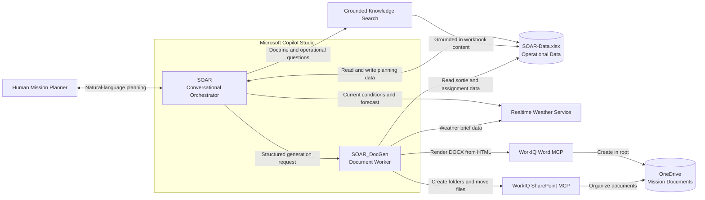
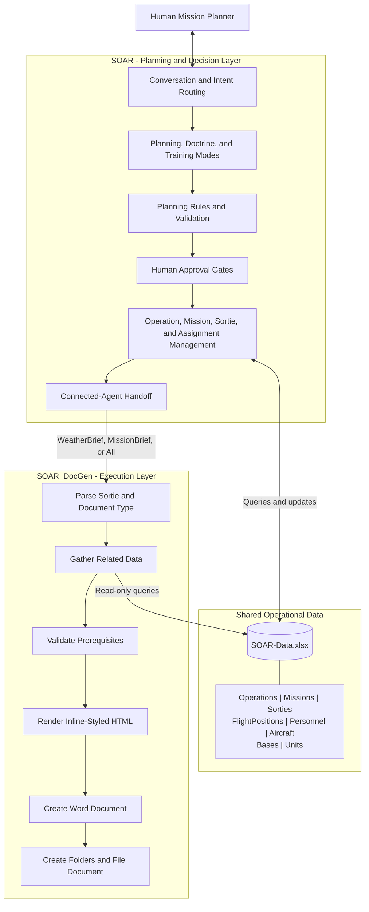
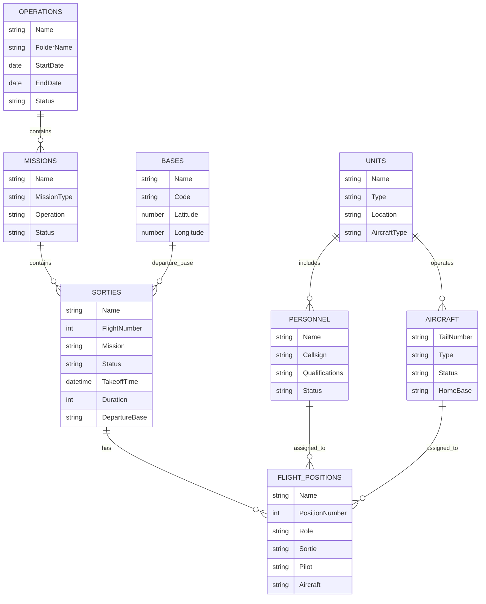
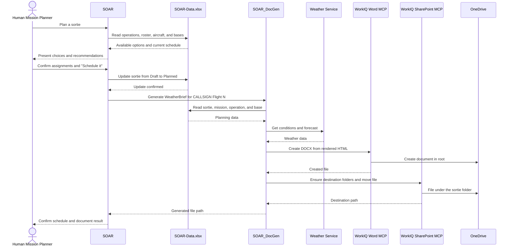

# SOAR Architecture

SOAR (Sortie Optimization & Allocation Resourcing) is a conversational planning assistant for US Air Force training operations. It helps a human planner create operations, missions, sorties, and flight positions; evaluate crew and aircraft availability; check weather; and generate mission paperwork.

SOAR is an assistant, not an autonomous planner. It can gather data, enforce planning rules, and recommend options, but the human planner retains decision authority. Crew and aircraft assignments and the transition from Draft to Planned require explicit confirmation.

The solution uses an orchestrator-and-worker design:

- **SOAR** is the user-facing orchestrator. It manages the conversation, planning rules, operating modes, data changes, and approval gates.
- **SOAR_DocGen** is a connected worker agent. It receives structured document requests, gathers the required data, renders documents, and files them in the correct mission folder.

## System Context



## Component Responsibilities



### SOAR

SOAR owns the interactive planning experience and the decisions that affect the schedule. Its responsibilities include:

- Guiding the planner through **Operation -> Mission (callsign) -> Sortie -> Flight Positions**.
- Reading operational data through grounded knowledge search and direct Excel queries.
- Creating and updating records through Excel Online actions.
- Enforcing callsign, qualification, crew-rest, aircraft-compatibility, and availability rules.
- Presenting recommendations while waiting for explicit approval before assignments or status changes.
- Checking realtime weather and surfacing risk conditions.
- Invoking SOAR_DocGen when documents are required.
- Supporting Planning, Doctrine, and Training modes.

### SOAR_DocGen

SOAR_DocGen is not intended for direct end-user conversation. It accepts a structured request such as `Generate WeatherBrief for VIPER Flight 1` and then:

1. Parses the sortie identifier and requested document type.
2. Reads the sortie and related operation, mission, base, crew, and aircraft data.
3. Validates document prerequisites.
4. Calls the weather service when generating a weather brief.
5. Renders the document as inline-styled HTML for Word compatibility.
6. Uses WorkIQ Word MCP to create the `.docx` file in the OneDrive root.
7. Uses WorkIQ SharePoint MCP to create the destination folders and move the file.
8. Returns a concise success path or a specific error to SOAR.

## Planning Data Model



The hierarchy separates the exercise or event from its callsign package, individual flights, and seat-level assignments:

```text
Operation (RED FLAG 26-2)
└── Mission (VIPER)
    └── Sortie (Flight 1)
        ├── Flight Position (VIPER 1-1, Flight Lead)
        └── Flight Position (VIPER 1-2, Wingman)
```

## Schedule and Generate Flow



The approval boundary is deliberate: a fully configured sortie remains **Draft** until the planner explicitly commits it. Folder creation and initial document generation occur only after the sortie becomes **Planned**.

## Document Outputs

| Document | Contents | Prerequisites |
|---|---|---|
| Weather Brief | Mission details, current conditions, forecast, and flight-risk assessment | Departure base assigned |
| Mission Brief | Mission data, crew and aircraft assignments, communications, and ordnance | Sortie Planned or later; all crew and aircraft assigned |

Documents use this folder structure:

```text
SOAR/
└── Missions/
    └── <OperationFolder>/
        └── <Callsign>_<FlightNumber>_<DDMMMYYYY>/
            ├── Weather_Brief_<Callsign>_<FlightNumber>_<DDMMMYYYY>.docx
            └── Mission_Brief_<Callsign>_<FlightNumber>_<DDMMMYYYY>.docx
```

Word MCP currently creates a document in the OneDrive root. SharePoint MCP then resolves or creates the operation and sortie folders and moves the document to its final location. This two-step save is an integration constraint, not a user-visible workflow.

## Operating Modes

| Mode | Purpose | Data Access |
|---|---|---|
| Planning | Concise operational planning | Read and write |
| Doctrine | Explain doctrine, terminology, processes, and constraints | Read-only |
| Training | Plan sorties while explaining rules and rationale | Read and write |

Modes change only through explicit user instruction. Doctrine mode cannot create or modify records or invoke document generation.

## Deployment View

SOAR and SOAR_DocGen are separate Copilot Studio agents and both must be imported, configured, and published in the same environment. Publish SOAR_DocGen first so the connected-agent action is available to SOAR.

The deployment requires these connections:

| Connection | Used By | Purpose |
|---|---|---|
| Excel Online (Business) | SOAR and SOAR_DocGen | Shared operational workbook; SOAR reads and writes, SOAR_DocGen reads |
| Realtime Weather flow | SOAR and SOAR_DocGen | Planning weather checks and weather brief content |
| WorkIQ Word MCP | SOAR_DocGen | Create Word documents from HTML |
| WorkIQ SharePoint MCP | SOAR_DocGen | Find or create folders and move generated files |

The operational workbook is the shared source of truth. Knowledge grounding and direct connector actions must be bound to the same `SOAR-Data.xlsx` workbook so conversational answers, updates, and generated documents remain consistent.

## Design Rationale

The two-agent design separates decision-oriented conversation from deterministic document execution. This keeps SOAR focused on planner interaction and authority while allowing document templates, validation, and file-management behavior to evolve independently in SOAR_DocGen. It also demonstrates a reusable Copilot Studio connected-agent pattern: an orchestrator decides **when and why** work should occur, while a specialized worker controls **how** that work is completed.
