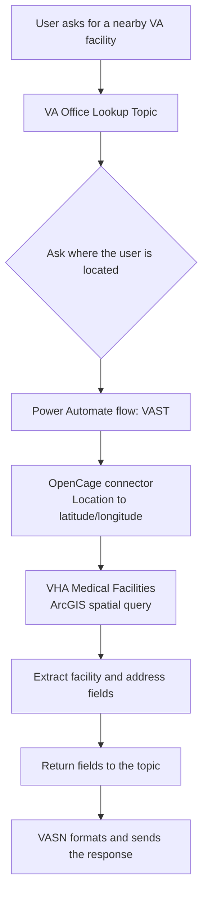

# VASN - VA Site Navigator

VASN is a **Microsoft Copilot Studio** agent that helps Veterans, their families, caregivers, and VA staff find a nearby **U.S. Department of Veterans Affairs (VA) facility**. The user provides a city or address, and VASN returns a nearby Veterans Health Administration (VHA) site of care with its facility name and address.

> **What it does in one line:** *"Where are you located?" -> a nearby VA facility.*

> [!NOTE]
> **This is a demonstration / proof-of-concept agent.** It is intended to be deployed and explored in a **sandbox or developer environment**, not in production. Use it to learn the pattern of collecting input, calling a custom connector, orchestrating a Power Automate flow, and formatting a response.

---

## Table of Contents

- [Features](#features)
- [How It Works](#how-it-works)
- [Architecture](#architecture)
- [Sample Run-Through](#sample-run-through)
- [Project Structure](#project-structure)
- [Components in Detail](#components-in-detail)
- [Setup & Deployment](#setup--deployment)
- [Data Sources](#data-sources)
- [Limitations](#limitations)

---

## Features

- **Natural-language lookup** - asks for the user's location when they request a nearby VA facility, medical center, clinic, Vet Center, or site of care.
- **Geospatial search** - geocodes the location and queries the VHA medical facilities dataset for one nearby facility.
- **Facility details** - returns the facility name, street address, city, state, and ZIP code.
- **Crisis guidance** - facility results include the Veterans Crisis Line: dial **988, then press 1**, or text **838255**.
- **Multi-channel** - configured for **Microsoft Teams** and **Microsoft 365 Copilot**.
- **Broader VA assistance** - agent instructions cover VA benefits, the VA Strategic Plan for 2023-2028, and the Veterans Crisis Line through configured knowledge sources.

---

## How It Works

1. The user asks to find a VA facility.
2. The **VA Office Lookup Topic** asks **"Where are you located?"**
3. VASN passes the location to the **VAST** Power Automate cloud flow.
4. The flow geocodes the location through the **OpenCage** custom connector.
5. The flow performs a spatial query against the public **Veterans Health Administration Medical Facilities** ArcGIS feature service and requests one matching facility.
6. The facility name and address fields are returned to the topic.
7. VASN formats the result and includes Veterans Crisis Line contact information.



---

## Architecture

| Layer | Component | Responsibility |
|-------|-----------|----------------|
| **Conversation** | `agent.mcs.yml` | Defines the VA Site Navigator identity, instructions, routing, scope, and safety guidance |
| **Topic** | `topics/VAOfficeLookupTopic.mcs.yml` | Collects the location, invokes the flow, and renders the facility result |
| **Topic** | `topics/Search.mcs.yml` | Supports generative answers from configured knowledge sources |
| **Connection** | `connectionreferences.mcs.yml` | References the OpenCage custom connector connection |
| **Automation** | `workflows/VAST-5e1638df-b287-f111-ab0f-70a8a59b63dd/workflow.json` | Geocodes the location and queries the VHA facilities dataset |
| **Channels and auth** | `settings.mcs.yml` | Configures Teams, Microsoft 365 Copilot, and integrated authentication |

---

## Sample Run-Through

**User**
> Find a VA facility near me.

**VASN**
> Where are you located?

**User**
> Murphy, Texas

**VASN**
> **VA Facility closest to Murphy, Texas**
>
> After calculating distance from Murphy, Texas and searching the VA Facilities database, below is a Veterans Affairs facility within 7 miles:
>
> **[Facility name] Facility**
>
> **Address:** [Street address]
>
> **City:** [City]
>
> **State:** [State]
>
> **ZIP Code:** [ZIP code]
>
> In case of an emergency, call the **Veterans Crisis Line** by dialing **988, then press 1**, or text **838255**.

The bracketed values represent data returned by the flow.

---

## Project Structure

```text
VA Site Navigator/
|-- agent.mcs.yml
|-- settings.mcs.yml
|-- connectionreferences.mcs.yml
|-- docs/
|   |-- README.md
|   `-- POC-SETUP.md
|-- topics/
|   |-- VAOfficeLookupTopic.mcs.yml
|   |-- Search.mcs.yml
|   `-- ...
`-- workflows/
    `-- VAST-5e1638df-b287-f111-ab0f-70a8a59b63dd/
        |-- metadata.yml
        `-- workflow.json
```

---

## Components in Detail

### Agent (`agent.mcs.yml`)
Defines the **VA Site Navigator** display name, audience, supported VA topics, facility-lookup routing, and Veterans Crisis Line safety response. It directs facility-location requests to the VA Office Lookup Topic and prohibits medical or clinical advice and appointment scheduling.

### VA Office Lookup Topic (`topics/VAOfficeLookupTopic.mcs.yml`)
The core lookup topic:

1. Asks **"Where are you located?"** and stores the answer in `Topic.Location`.
2. Calls the VAST flow, passing the location as `text`.
3. Binds the returned `site_code`, `address`, `city`, `state`, and `zip` values to topic variables.
4. Renders the formatted facility response and Veterans Crisis Line guidance.

### OpenCage Connection
The VAST flow uses an OpenCage custom connector operation named `ForwardGeocoding` to convert the user's location into latitude and longitude. This repository contains the connection reference used by the imported agent package; the custom connector definition itself is not included in this folder.

### Power Automate Flow (`workflows/VAST-5e1638df-b287-f111-ab0f-70a8a59b63dd/workflow.json`)
1. **Trigger:** receives a required `text` location from the topic.
2. **Geocode:** calls OpenCage and extracts latitude and longitude.
3. **Spatial query:** sends an HTTP GET request to the public VHA Medical Facilities ArcGIS FeatureServer using an `esriGeometryPoint` and statute-mile distance.
4. **Parse:** reads the first returned feature.
5. **Respond:** returns facility name, address, city, state, and ZIP code to VASN.

---

## Setup & Deployment

See **[POC-SETUP.md](POC-SETUP.md)** for prerequisites, import guidance, connection setup, flow verification, channel configuration, testing, and troubleshooting.

---

## Data Sources

- **Geocoding:** [OpenCage Forward Geocoding API](https://opencagedata.com/) converts the user's place name into coordinates.
- **VA facilities:** Public **Veterans Health Administration Medical Facilities** ArcGIS FeatureServer hosted on ArcGIS Online supplies facility and address data.

---

## Limitations

- The flow requests only the first facility returned by the ArcGIS query. It does not explicitly set a distance-based sort order.
- The flow currently queries within **6 statute miles**, while the topic response says **within 7 miles**. Align these values before relying on the stated radius.
- The topic assumes the ArcGIS response contains at least one feature; there is no explicit no-results response path.
- Returned details are limited to facility name, street address, city, state, and ZIP code.
- Accuracy depends on the OpenCage geocoding result and the freshness of the VHA ArcGIS dataset.
- This is an unofficial proof of concept and is not affiliated with or endorsed by the U.S. Department of Veterans Affairs.

---

*For official information, visit [VA.gov](https://www.va.gov/). For immediate crisis support, dial **988, then press 1**, text **838255**, or visit [VeteransCrisisLine.net](https://www.veteranscrisisline.net/).*

